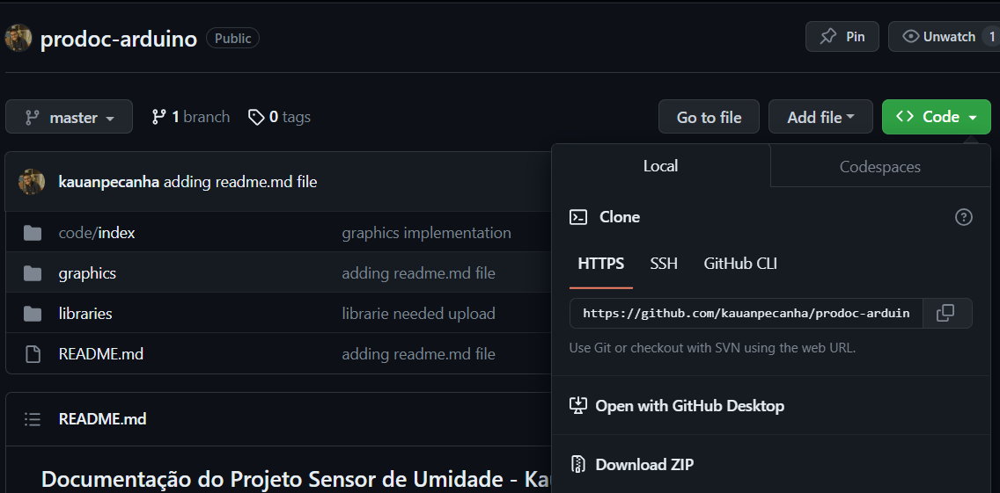

# Documentação do Projeto Sensor de Umidade
## Aluno: Kauan Peçanha Lira, Prodocência, Professor Joel Sanchez

### Primeiro passo: clonagem do repositório usando o comando
O download do repositório pode ser feito de duas formas:

#### Usando git
Para efetuar esse processo usando git, deve-se tê-lo já instalado e configurado em seu dispositivo. Partindo desse pressuposto, deve-se efetuar o seguinte comando:

```
git clone https://github.com/kauanpecanha/prodoc-arduino.git
```

ou

#### Efetuando download via GitHub
Esse processo pode ser feito apenas clicando no botão verde representado por **<> Code**, evidenciado abaixo, e em seguida, pelo botão **Download ZIP**
