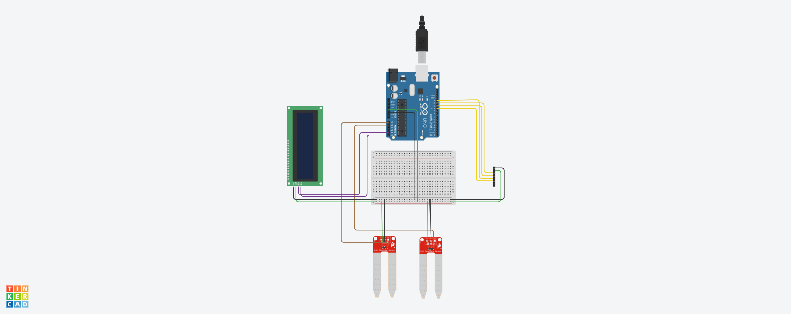
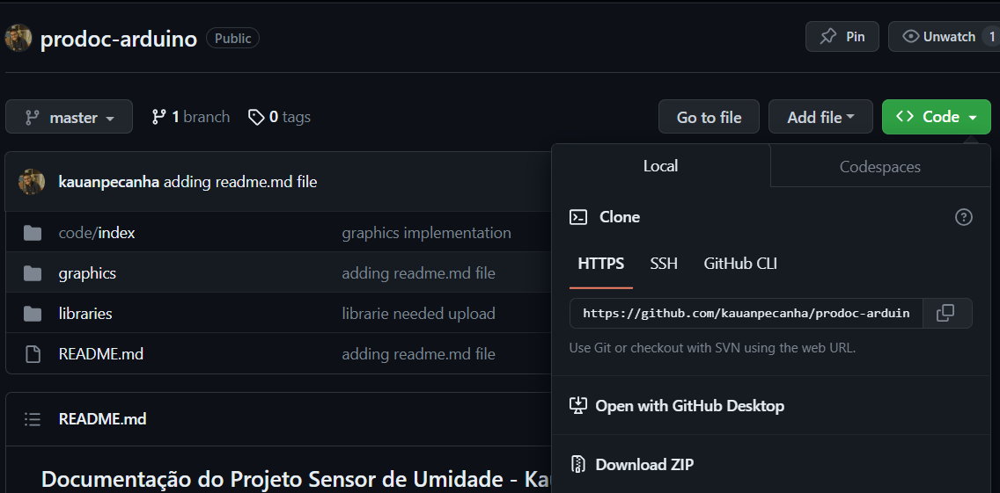
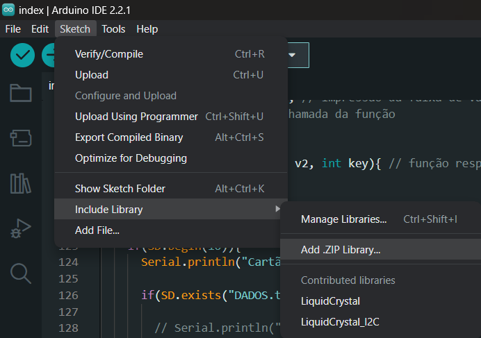
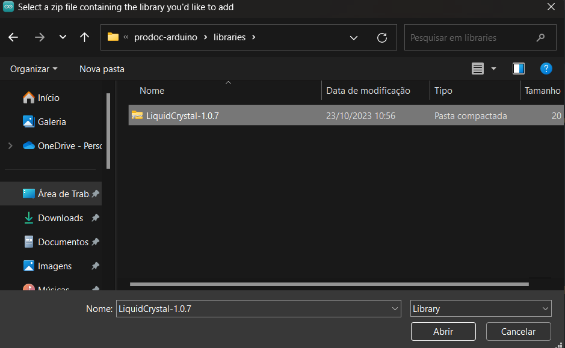
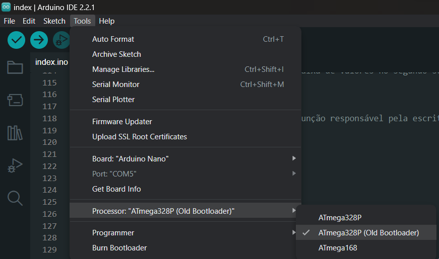

# Documentação do Projeto Sensor de Umidade
### Aluno: Kauan Peçanha Lira, orientado por Joel Sanchez


Link de acesso ao esquemático: 

```
https://www.tinkercad.com/things/lxWJtIfUeyX-smashing-borwo/editel?sharecode=JdSH1l1yhUQeN3z1_wAQ2dtctfAweqM22B2U45LUTqE
```

Link de acesso ao projeto da embalagem:
```
https://app.sketchup.com/app?hl=pt-BR
```

## 🔻 Primeiro passo: clonagem do repositório usando o comando
O download do repositório pode ser feito de duas formas:

### Usando git
Para efetuar esse processo usando git, deve-se tê-lo já instalado e configurado em seu dispositivo. Partindo desse pressuposto, deve-se efetuar o seguinte comando:

```
git clone https://github.com/kauanpecanha/prodoc-arduino.git
```

ou

### Efetuando download via GitHub
Esse processo pode ser feito apenas clicando no botão verde representado por **<> Code**, evidenciado abaixo, e em seguida, pelo botão **Download ZIP**


### Observação sobre a estrutura do reposiório

Uma vez que o repositório já se encontra na máquina, agora, deve-se ter um entendimento básico de sua estrutura de pastas, de forma que elas sejam alocadas devidamente em cada dispositivo.

#### Pasta code

Dentro da pasta **code**, pode-se encontrar outra, nomeada **index**, e dentro, um arquivo **index.ino**. A pasta index pode ser aberta dentro do editor de código que o usuário utilizar para desenvolvimento de software arduino. Nesse caso, foi utilizado a IDE própria do Arduino, que pode ser encontrada em:

```
https://www.arduino.cc/en/software
```

#### Pasta graphics

Dentro da pasta **graphics**, podem ser encontrados dois arquivos distintos: **index.py**, e **requirements.txt**. O arquivo python é utilizado para criação e exibição dos gráficos das umidades detectadas por cada um dos sensores. O arquivo .txt é usado para que o usuário possa fazer download de todas as bibliotecas imprescindíveis para o funcionamento do arquivo python.

#### Pasta libraries

Dentro dessa pasta, pode-se encontrar um arquivo .zip da biblioteca LiquidCrystal, sendo esta importantíssima para o correto funcionamento da IDE Arduino no que tange ao desenvolvimento do output do visor LCD, que conta com um módulo I2C, o qual exige a instalação desta.

Além dela, se encontra um arquivo de instalação do python v. 3.12.0, o qual foi a versão utilizada no desenvolvimento dos gráficos.

**Os demais arquivos presentes nesse repositório tem o intuito de serem meramente informativos.**

## 💻 Segundo passo: Instalação
Para a instalação, são exigidos dois mecanismos:
- Python e pip install devidamente instalados
- Software de extração de arquivos .zip

A seguir, deve-se proceder com os seguintes:
- Com o cmd aberto dentro da pasta graphics, entrar com o comando ```pip install -r requirements.txt```, para que possam ser instaladas todas as dependências python
- Inserção da LiquidCrystal na IDE através de **Sketch** -> **Include Library** -> **Add .ZIP Library**, e selecionar o arquivo .zip da LiquidCrystal, dentro de **libraries**, e então, concretizar apertando em **Abrir**



## 📂 Terceiro passo: Alocação dos arquivos
- O arquivo **index.ino** deve passar pelo upload para a placa arduino.
- O arquivo **index.py** deve estar dentro do cartão de memória utilizado, uma vez que é imprescindível que ele esteja na mesma pasta que o arquivo index.txt criado dentro do cartão para armazenamento dos valores vindos dos sensores de umidade.

Dessa forma, o sensor duplo de umidade estará em pleno funcionamento.

## 🌳 Quarto passo: Uso do dispositivo e plotagem do gráfico
O dispositivo deve ser conectado a uma fonte de energia através de uma fonte, e seus sensores, em um, ou dois solos distintos. Assim, o dispositivo exibirá no leitor LCD a faixa de porcentagem de umidade do solo, para verificação do usuário.

Ao finalizar, o cartão SD deve ser retirado do módulo de leitura e incluso no Desktop através de um adaptador SD. Com ele plugado, o usuário deve executar o arquivo python que se encontra no mesmo diretório do arquivo de texto, usando os seguinte comando: ```python index.py```. Dessa forma, o gráfico com todas as informações extraídas poderá ser contemplado.

## Considerações finais sobre o funcionamento do módulo
- O compartimento onde se encontra o microcontrolador **deve se encontrar em um local seguro, longe de quaisquer líquidos**, com o intuito de **não se danificar a placa microcontroladora**.

- Caso, na IDE do Arduino, ocorrer o seguinte erro: ```avrdude: stk500_getsync() attempt 1 of 10: not in sync: resp=0x00```, a solução se dá através da seguinte forma: troca de processador de ```ATmega328p``` para ```ATmega328p(Old Bootloader)```
